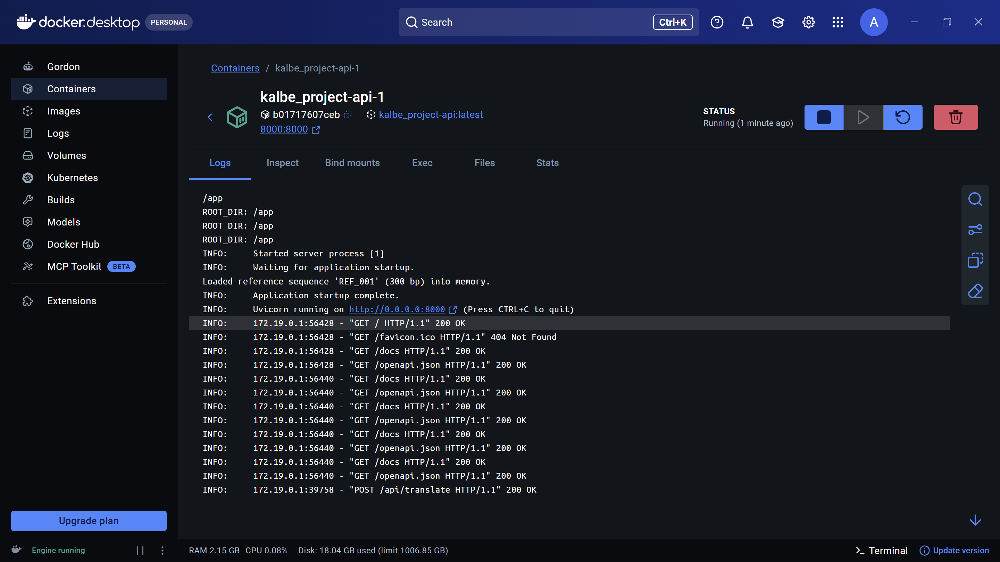
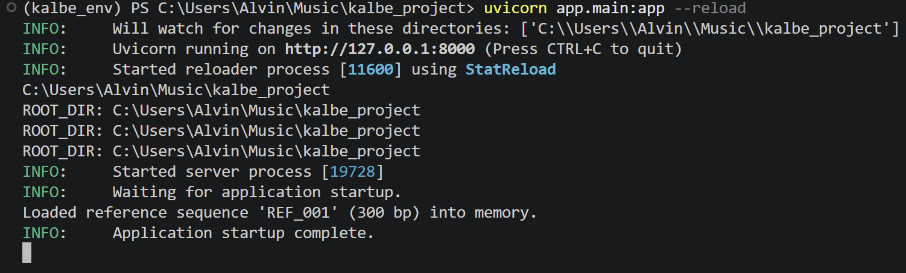
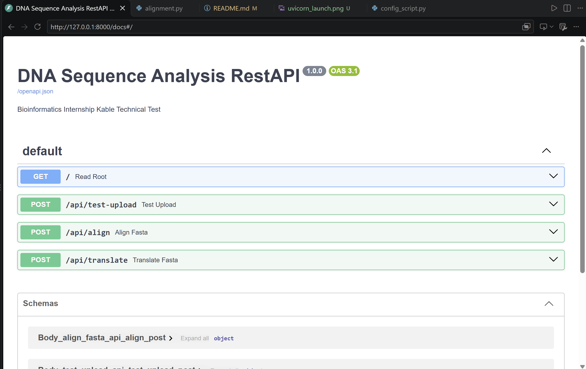
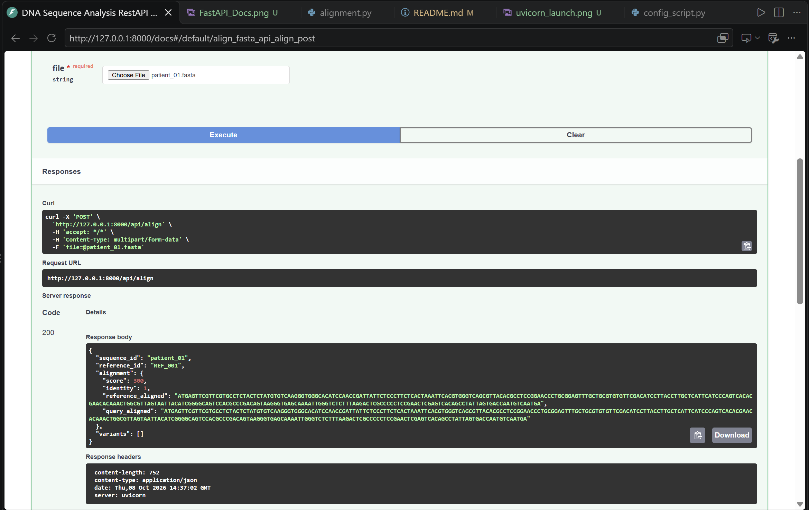
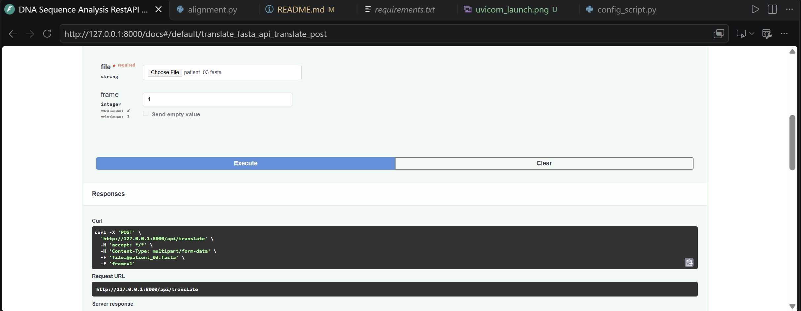
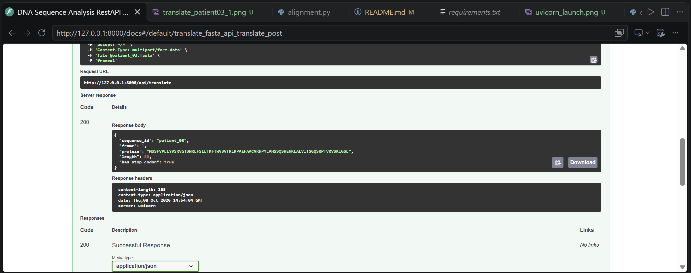
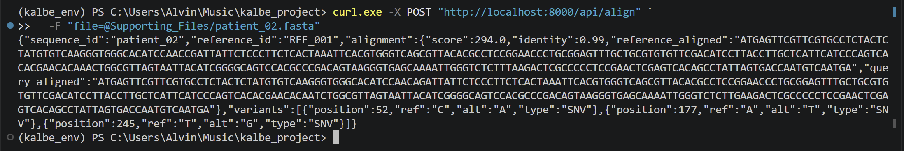
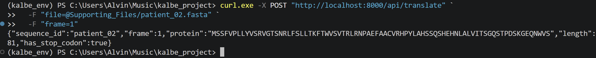

## Local installation

Create and activate a conda virtual environment, then install the API dependencies:

```powershell
conda create -n kalbe_env python==3.12.4
conda activate kalbe_env
conda install --file config/requirements.txt
```

Run the API locally:

```powershell
python -m uvicorn app.main:app --reload
```

Run the automated tests from the project root:

```powershell
python -m pytest -v tests/test_api.py
```

## Run with Docker Compose

Install and start Docker Desktop, then open PowerShell in the project root:

```powershell
docker compose up
```

Compose builds the API image from the `Dockerfile` on the first run and starts
the container. The API is available from the host at `http://localhost:8000`;
interactive API documentation is at `http://localhost:8000/docs`.

To rebuild after changing the Dockerfile, dependencies, or application code:

```powershell
docker compose up --build
```

To stop and remove the container and its Compose network:

```powershell
docker compose down
```

The Compose service is named `api`. Other containers on the same Compose
network can reach the backend at `http://api:8000`; use `localhost` only from
the host machine. Uvicorn binds to `0.0.0.0` inside the container so Docker can
forward traffic to it.

## Docker Container is up:


# 1. Launching FastAPI:





# 2. Testing `Supporting_Files/patient_01.fasta` into post/alignment



# 3. Global Alignment:

Using dynamic programming needleman_wunsch()
Rule:
- Same Base: +1
- Different Base: -1
- Gap: -2 per character

## 3.1 Workflow:
1. Match one base reference with one base query (match/mismatch)
2. Match one reference base with gap from query (deletion relative to the reference)
3. Match gap from reference to query base (insertion relative to the reference)

Traceback started from each end of both sequence for shaping the final match alignment.

during traceback, priority is set consistenly:
- diagonal -> up -> left

meaning: if there is some matching steps that gave optimum score, code will prioritize matching base, than gap from query, than gap from reference.

## 3.2 calculate_identity() calculate: 

total of column with base of A/C/G/T that matches / total of all column alignment.

Column that has gap(s) and matching N/N still count as total column but not match, which will be rounded.

## 3.3 detect_variants:
- SNV: only if 2 base difference and both A/C/G/T. position using coordinate reference 1-based.
- Deletion: gap from query. Deleted base will be merged if it's sequential; position is from first base reference that got deleted.
- Insertion: gap from reference. Base that is inserted is merged if it's sequential. Position is previous coordinate base reference.


# 4. Translate Protein: 




# 5. Test Alignment & Translation & Validation from `test_api.py`
```
(kalbe_env) PS C:\Users\Alvin\Music\kalbe_project> python -m pytest -v tests/test_api.py
=========================================================== test session starts ============================================================
platform win32 -- Python 3.12.4, pytest-9.1.1, pluggy-1.6.0 -- C:\Users\Alvin\miniconda3\envs\kalbe_env\python.exe
cachedir: .pytest_cache
rootdir: C:\Users\Alvin\Music\kalbe_project
plugins: anyio-4.15.1
collected 24 items                                                                                                                          

tests/test_api.py::test_align_patient[1] PASSED                                                                                       [  4%]
tests/test_api.py::test_align_patient[2] PASSED                                                                                       [  8%]
tests/test_api.py::test_align_patient[3] PASSED                                                                                       [ 12%]
tests/test_api.py::test_align_patient[4] PASSED                                                                                       [ 16%]
tests/test_api.py::test_align_patient[5] PASSED                                                                                       [ 20%]
tests/test_api.py::test_translate_patient[1] PASSED                                                                                   [ 25%]
tests/test_api.py::test_translate_patient[2] PASSED                                                                                   [ 29%]
tests/test_api.py::test_translate_patient[3] PASSED                                                                                   [ 33%]
tests/test_api.py::test_translate_patient[4] PASSED                                                                                   [ 37%]
tests/test_api.py::test_translate_patient[5] PASSED                                                                                   [ 41%]
tests/test_api.py::test_invalid_fasta_header_is_rejected[/api/align-ATGAAATAA\n] PASSED                                               [ 45%]
tests/test_api.py::test_invalid_fasta_header_is_rejected[/api/align->\nATGAAATAA\n] PASSED                                            [ 50%]
tests/test_api.py::test_invalid_fasta_header_is_rejected[/api/align->sample_1\nATG\n>sample_2\nCCC\n] PASSED                          [ 54%]
tests/test_api.py::test_invalid_fasta_header_is_rejected[/api/translate-ATGAAATAA\n] PASSED                                           [ 58%]
tests/test_api.py::test_invalid_fasta_header_is_rejected[/api/translate->\nATGAAATAA\n] PASSED                                        [ 62%]
tests/test_api.py::test_invalid_fasta_header_is_rejected[/api/translate->sample_1\nATG\n>sample_2\nCCC\n] PASSED                      [ 66%]
tests/test_api.py::test_translate_reading_frames[1-MK-True] PASSED                                                                    [ 70%]
tests/test_api.py::test_translate_reading_frames[2--True] PASSED                                                                      [ 75%]
tests/test_api.py::test_translate_reading_frames[3-EI-False] PASSED                                                                   [ 79%]
tests/test_api.py::test_translate_n_codon_as_x PASSED                                                                                 [ 83%]
tests/test_api.py::test_translate_ignores_incomplete_final_codon PASSED                                                               [ 87%]
tests/test_api.py::test_invalid_fasta_is_rejected PASSED                                                                              [ 91%]
tests/test_api.py::test_invalid_frame_is_rejected[0] PASSED                                                                           [ 95%]
tests/test_api.py::test_invalid_frame_is_rejected[4] PASSED                                                                           [100%]

============================================================ 24 passed in 0.77s ============================================================
(kalbe_env) PS C:\Users\Alvin\Music\kalbe_project> 
```

# 6. Curl Alignment & Translate



